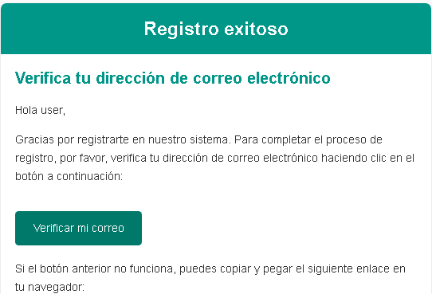
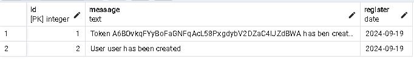

# Verificación de email

### Sistema de verificación de email

El usuario se registra y automáticamente se envía un correo electrónico de verificación. El código se generado con SecureRandom y almacenado en una base de datos SQL.

## Generando el código
```java
public static String generate() {
    SecureRandom secureRandom = new SecureRandom();

    byte[] randomBytes = new byte[32];
    secureRandom.nextBytes(randomBytes);
    String code = Base64.getUrlEncoder().withoutPadding().encodeToString(randomBytes);
    return code;
}

public static LocalDateTime expireInHour() {
    LocalDateTime localTime = LocalDateTime.now();
    long seconds = Duration.ofHours(1).getSeconds();
    return localTime.plusSeconds(seconds); 
}
```

## Enviando el correo electrónico
```java
    @Override
public void send(final Users users) throws MessagingException {
    MimeMessage mimeMessage = javaMailSender.createMimeMessage();
    MimeMessageHelper mimeMessageHelper = new MimeMessageHelper(mimeMessage);

    mimeMessageHelper.setFrom("verify@account.com");
    mimeMessageHelper.setSubject("Verifica tu correo electrónico");
    mimeMessageHelper.setTo(users.getEmail());

    String token = users.getEmailToken().getToken();
    
    String template = getTemplateProccess(users, token);
    mimeMessageHelper.setText(template, true);

    System.out.println(token);

    javaMailSender.send(mimeMessage);
}
    
private String getTemplateProccess(final Users users, final String token) {
    Context context = new Context();
    context.setVariable("user", users);
    context.setVariable("redirectUri", redirectUri);
    context.setVariable("token", token);
    return templateEngine.process("email", context);
}
```

### Verificando el código enviado

```java
@Autowired
private UserRepositoryService userRepositoryService;

@Autowired
private MailService mailService;

@Override
public ModelAndView verify(String token) {
    Optional<EmailToken> emailToken = emailTokenRepositoryService.findByToken(token);
    boolean isValid = GenerateSecureCodeUtil.verifyCode(emailToken);
    emailTokenRepositoryService.setTokenConsumed(emailToken.get());
    
    String templateName;
    
    if (isValid) {
        templateName = "verified";
    }
    else {
        templateName = "expired";
    }
    
    return TemplateUtil.generate(templateName);
}
```

## Buzón y verificación



## Auditoría

Se maneja una auditoría para controlar las inserciones de nuevos usuarios y tokens a través de una función y un disparador.

```sql
CREATE OR REPLACE FUNCTION fnAuditory() RETURNS trigger AS $$
	DECLARE
		szMessage TEXT;

	BEGIN 
		IF tg_table_name LIKE '%users%' THEN 
			szMessage := FORMAT('User %s has been created', new.username);
			INSERT INTO postgres.auditory (message) VALUES (szMessage);
		ELSE 
			szMessage := FORMAT('Token %s has ben created', new.token);
			INSERT INTO postgres.auditory (message) VALUES (szMessage);
		END IF;
		
		RETURN NEW;
	END;
$$ LANGUAGE plpgsql;

CREATE TRIGGER onTriggerSaveUser
AFTER INSERT ON postgres.users
FOR EACH ROW
EXECUTE FUNCTION postgres.fnAuditory();

CREATE TRIGGER onTriggerSaveToken
AFTER INSERT ON postgres.email_token
FOR EACH ROW
EXECUTE FUNCTION postgres.fnAuditory();

```
